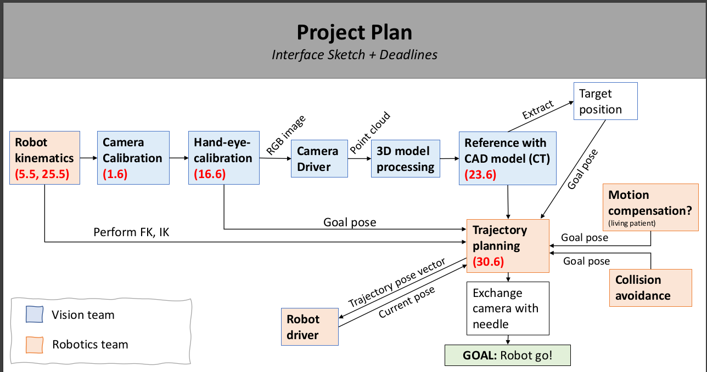

## Image Guided Robotic Needle Placement




**To run the code from this directory**

```ros
$ cd catkin_ws/src
$ git clone git@github.com:Image-Guided-Robotic-Needle-Placement/rnm_needle_placement.git
$ cd rnm_needle_placement && git checkout selva
```
**To make it in ros package structure**

```ros
$ mv needle_placement ../
$ mv README.md ../ && cd ..
$ rm -rf rnm_needle_placement
```

**Building the package**

- Make sure you are in `$ catkin_ws/src`

```ros
catkin_make
```

**To run the node**


**Testing the forward kinematics node**

```ros
rosrun needle_placement forward_kinematics.py
```

- `/end_effector_pose` is the topic that publishes the direct kinematics result
- `/tf` publishes the transformation matrix from `base_link` to `end_effector`

```ros
rostopic echo /end_effector_pose 
```
and (from the project description)
```ros
rosrun tf tf_echo panda_link0 panda_link8
```

**Testing the inverse kinematics node**

```ros
rosrun needle_placement inverse_kinematics.py
```
